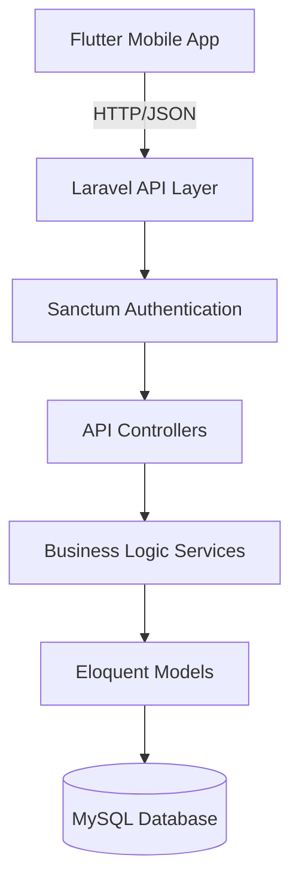
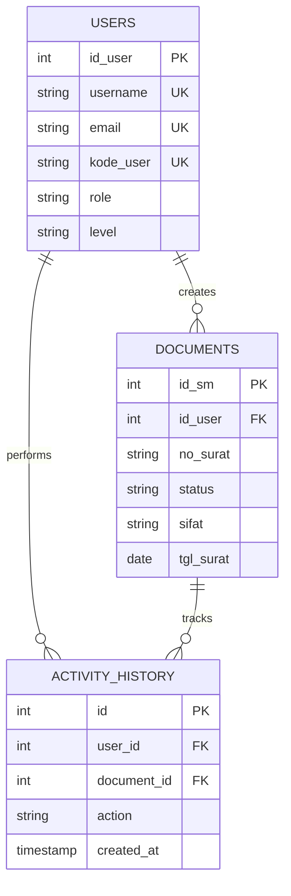
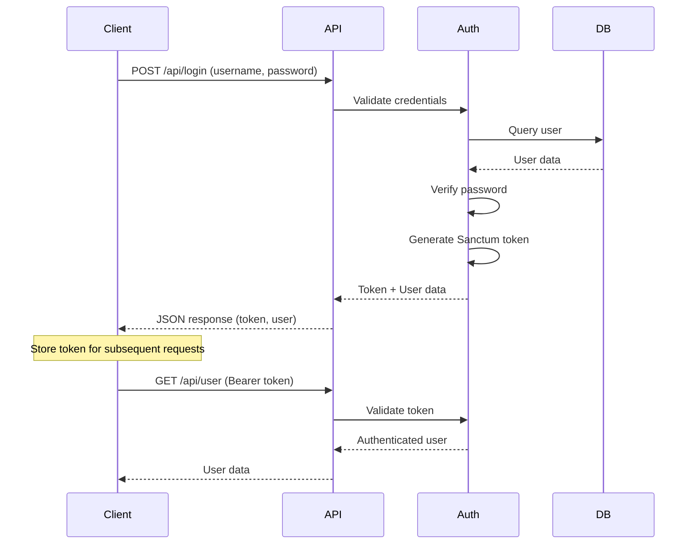

# Backend API Laravel 12 - Design Document

## Overview

This design document outlines the architecture and strategic approach for developing a Laravel 12 backend API application that serves as the server-side component for the SIAP (Sistem Informasi Administrasi Perkantoran) document management system. The API will provide authentication, document management, meeting management, and user profile functionalities.

## Business Context

### Purpose
To provide a RESTful API backend that enables secure access to document management operations, user authentication, and meeting coordination for the SIAP Flutter mobile application.

### Key Objectives
- Provide secure API-based authentication using Laravel Sanctum
- Enable role-based document access and management
- Support meeting workflow and decision tracking
- Maintain user activity history
- Ensure data consistency and validation

## System Architecture

### High-Level Architecture

### Architectural Principles
- **API-Only Architecture**: No views or blade templates, purely RESTful JSON responses
- **Token-based Authentication**: Stateless authentication using Laravel Sanctum tokens
- **Service Layer Pattern**: Business logic separated from controllers for maintainability
- **Repository Pattern Consideration**: For complex queries, repositories may abstract data access
- **Role-based Authorization**: Access control based on user roles and levels

## Data Architecture

### Core Data Entities

#### User Entity
Represents system users with authentication credentials and role information.

| Field | Type | Purpose | Validation Rules |
|-------|------|---------|------------------|
| id_user | Primary Key | Unique identifier | Auto-increment, required |
| username | String | Login identifier | Unique, required, max 100 chars |
| password | Hashed String | Authentication credential | Hashed (bcrypt), required |
| nama_lengkap | String | Full name | Required, max 255 chars |
| jabatan | String | Position/title | Required, max 255 chars |
| role | Enum | User role type | Required, values: user, admin, pimpinan |
| instansi | String | Institution code | Required, max 50 chars |
| email | Email | Contact email | Valid email format, unique, required |
| telp | String | Phone number | Max 20 chars |
| level | String | Access level | Required |
| level_pimpinan | String | Leadership level | Nullable |
| level_tu | String | Administrative level | Nullable |
| level_admin | String | Admin level | Nullable |
| level_manajemen | String | Management level | Default 0 |
| kode_user | String | User code | Unique, required |
| terakhir_login | Timestamp | Last login time | Auto-updated |
| fcm_token | Text | Firebase notification token | Nullable |
| login_attempts | Integer | Failed login counter | Default 0 |
| blocked_until | Timestamp | Account block expiry | Nullable |

#### Document Entity (tbl_sm)
Represents incoming/outgoing documents with metadata and workflow status.

| Field | Type | Purpose | Validation Rules |
|-------|------|---------|------------------|
| id_sm | Primary Key | Document identifier | Auto-increment, required |
| no_surat | String | Document number | Required, max 50 chars |
| tgl_ns | Date | Document registration date | Required, date format |
| no_asal | String | Original number | Required, max 100 chars |
| tgl_surat | Date | Document date | Required, date format |
| pengirim | String | Sender information | Required, max 255 chars |
| penerima | String | Recipient information | Required, max 255 chars |
| perihal | Text | Subject/matter | Required |
| token_lampiran | String | Attachment token | MD5 hash, nullable |
| id_user | Foreign Key | Creator user | Required, references users |
| id_instansi | String | Institution identifier | Required |
| lampiran | String | Attachment description | Nullable |
| status | Enum | Document status | Required, values: Dokumen, Rapat, Selesai |
| sifat | Enum | Document priority | Required, values: Segera, Biasa, Rahasia |
| dibaca | Boolean | Read status | Default 0 |
| dibaca_pimpinan | Boolean | Leadership read status | Default 0 |
| kategori_surat | String | Document category code | Required |
| klasifikasi_surat | String | Document classification | Required |
| is_notes_pimpinan | Boolean | Has leadership notes | Default 0 |
| status_tu | Boolean | Administrative status | Default 0 |
| tgl_disposisi | Timestamp | Disposition date | Nullable |
| disposisi | Text | Disposition instructions | Nullable |
| catatan | Text | General notes | Nullable |

#### Meeting-Related Fields (within Document)
Fields specific to meeting workflow within the document entity.

| Field | Purpose |
|-------|---------|
| tgl_agenda_rapat | Meeting scheduled date |
| jam_rapat | Meeting time |
| ruang_rapat | Meeting room location |
| bahasan_rapat | Meeting agenda/topics |
| peserta_rapat | Meeting participants list |
| pimpinan_rapat | Meeting leader |
| id_status_rapat | Meeting status identifier |
| tgl_hasil_rapat | Meeting result/decision date |
| disposisi_rapat | Meeting disposition |

### Entity Relationships

## API Architecture

### Authentication Flow

### API Endpoint Specifications

#### Authentication Endpoints

**POST /api/login**
- **Purpose**: Authenticate user and issue access token
- **Request Body**:
  - username (required, string)
  - password (required, string)
  - fcm_token (optional, string) - for push notifications
- **Success Response** (200):
  - token (string) - Sanctum bearer token
  - user (object) - User profile data
- **Error Responses**:
  - 401: Invalid credentials
  - 403: Account blocked due to excessive failed attempts
  - 422: Validation errors
- **Business Logic**:
  - Track login attempts, block after 5 failed attempts for 30 minutes
  - Update last login timestamp
  - Store FCM token if provided
  - Clear login attempts counter on success

**POST /api/logout**
- **Purpose**: Revoke current access token
- **Authentication**: Required (Bearer token)
- **Success Response** (200): Confirmation message
- **Business Logic**:
  - Revoke current token only (other sessions remain active)
  - Clear FCM token associated with this session

**GET /api/user**
- **Purpose**: Retrieve current authenticated user basic information
- **Authentication**: Required
- **Success Response** (200): User object with essential fields
- **Fields Returned**: id_user, username, nama_lengkap, role, level, kode_user

**GET /api/profile**
- **Purpose**: Retrieve complete user profile information
- **Authentication**: Required
- **Success Response** (200): Complete user object including contact details, levels, last login
- **Fields Excluded**: password, token

#### Document Management Endpoints

**GET /api/documents**
- **Purpose**: Retrieve paginated list of documents with role-based filtering
- **Authentication**: Required
- **Query Parameters**:
  - page (integer, default: 1)
  - per_page (integer, default: 15, max: 100)
  - status (string, optional) - filter by document status
  - sifat (string, optional) - filter by priority
  - search (string, optional) - search in no_surat, pengirim, perihal
  - date_from (date, optional) - filter from date
  - date_to (date, optional) - filter to date
  - kategori_surat (string, optional) - filter by category
- **Success Response** (200): Paginated document collection
- **Role-based Filtering Logic**:
  - Admin: Access all documents within their institution
  - Pimpinan (Leadership): Access all documents in institution plus documents assigned to them
  - User: Access only documents they created or documents assigned to them
- **Response Includes**: pagination metadata, filtered data

**GET /api/documents/{id}**
- **Purpose**: Retrieve single document detail
- **Authentication**: Required
- **Path Parameter**: id (document id_sm)
- **Success Response** (200): Complete document object
- **Error Responses**:
  - 404: Document not found
  - 403: Unauthorized access based on role
- **Business Logic**:
  - Mark document as read (dibaca) for regular users
  - Mark as dibaca_pimpinan if accessed by leadership role
  - Enforce role-based access control

**POST /api/documents**
- **Purpose**: Create new document
- **Authentication**: Required
- **Authorization**: All authenticated users can create
- **Request Body**:
  - no_asal (required, string)
  - tgl_surat (required, date)
  - pengirim (required, string)
  - penerima (required, string)
  - perihal (required, text)
  - sifat (required, enum: Segera, Biasa, Rahasia)
  - kategori_surat (required, string)
  - klasifikasi_surat (required, string)
  - lampiran (optional, string)
  - token_lampiran (optional, string)
- **Success Response** (201): Created document object
- **Business Logic**:
  - Auto-generate no_surat based on sequence
  - Set id_user to authenticated user
  - Set id_instansi from user's institution
  - Set default status to 'Dokumen'
  - Set tgl_ns and tgl_sm to current date
  - Generate unique kode_user references

**PUT /api/documents/{id}**
- **Purpose**: Update existing document
- **Authentication**: Required
- **Authorization**: Document creator or admin role
- **Path Parameter**: id (document id_sm)
- **Request Body**: Same fields as create, all optional
- **Success Response** (200): Updated document object
- **Error Responses**:
  - 404: Document not found
  - 403: Not authorized to update
  - 422: Validation errors
- **Business Logic**:
  - Only allow updates if document status is 'Dokumen' (not in workflow)
  - Admins can update any document in their institution

**DELETE /api/documents/{id}**
- **Purpose**: Soft delete document
- **Authentication**: Required
- **Authorization**: Admin role only
- **Path Parameter**: id (document id_sm)
- **Success Response** (200): Confirmation message
- **Error Responses**:
  - 404: Document not found
  - 403: Insufficient permissions
- **Business Logic**:
  - Use soft delete (deleted_at timestamp)
  - Only allow deletion if no dispositions exist

**PUT /api/documents/{id}/status**
- **Purpose**: Update document workflow status
- **Authentication**: Required
- **Authorization**: Based on role and current status
- **Path Parameter**: id (document id_sm)
- **Request Body**:
  - status (required, enum: Dokumen, Rapat, Selesai)
  - disposisi (optional, text)
  - catatan (optional, text)
  - tgl_disposisi (auto-set to current timestamp)
- **Success Response** (200): Updated document
- **Authorization Rules**:
  - Pimpinan role: Can change any status
  - Admin: Can change status within institution
  - User: Cannot change status
- **Business Logic**:
  - Validate status transitions (Dokumen → Rapat → Selesai)
  - Set appropriate timestamp fields based on status

#### Meeting Management Endpoints

**GET /api/meetings**
- **Purpose**: Retrieve documents with status 'Rapat' (meetings)
- **Authentication**: Required
- **Query Parameters**: Same as GET /api/documents
- **Success Response** (200): Paginated meeting documents
- **Business Logic**:
  - Automatically filter where status = 'Rapat'
  - Apply same role-based access control as documents
  - Include meeting-specific fields in response

**POST /api/meetings/{id}/decision**
- **Purpose**: Record meeting decision and update status
- **Authentication**: Required
- **Authorization**: Pimpinan role only
- **Path Parameter**: id (document id_sm)
- **Request Body**:
  - disposisi_rapat (required, text) - meeting decision
  - tgl_hasil_rapat (optional, date) - defaults to current date
  - status (optional, enum) - new status after meeting
  - catatan (optional, text)
- **Success Response** (200): Updated document with meeting decision
- **Error Responses**:
  - 404: Document not found or not a meeting
  - 403: Not authorized (not pimpinan role)
  - 422: Validation errors
- **Business Logic**:
  - Verify document status is 'Rapat'
  - Update disposisi_rapat and tgl_hasil_rapat
  - Optionally transition status to 'Selesai'

#### History Endpoint

**GET /api/history**
- **Purpose**: Retrieve user activity history
- **Authentication**: Required
- **Query Parameters**:
  - page (integer, default: 1)
  - per_page (integer, default: 20)
  - date_from (date, optional)
  - date_to (date, optional)
  - action_type (string, optional) - filter by action type
- **Success Response** (200): Paginated activity history
- **Response Structure**:
  - activity records with timestamp, action, document reference, description
- **Business Logic**:
  - Track actions: login, logout, create_document, update_document, view_document, status_change, meeting_decision
  - Users see only their own history
  - Admins can see history for their institution with user_id query parameter

## Security Architecture

### Authentication Strategy
- **Mechanism**: Laravel Sanctum token-based authentication
- **Token Storage**: Tokens stored in personal_access_tokens table
- **Token Scope**: Single token per device/session
- **Token Lifetime**: Configurable, recommended 30 days with activity refresh

### Authorization Strategy
- **Role Hierarchy**:
  - Admin: Full CRUD within institution scope
  - Pimpinan: Read all, update status, meeting decisions
  - User: Create documents, read assigned documents, update own documents

### Security Measures
- **Password Security**: Bcrypt hashing with minimum 8 character requirement
- **Rate Limiting**: Apply to login endpoint (5 attempts per 15 minutes)
- **Account Lockout**: Block account for 30 minutes after 5 failed login attempts
- **Input Validation**: Validate all inputs using Laravel Form Requests
- **SQL Injection Prevention**: Use Eloquent ORM and parameter binding
- **XSS Prevention**: Sanitize text inputs, escape outputs
- **CORS Configuration**: Restrict to Flutter app domain in production

### Data Privacy
- **Password Handling**: Never return password in API responses
- **Token Security**: Tokens transmitted only over HTTPS
- **Sensitive Data**: Exclude internal tokens and hashes from API responses

## Validation Rules

### Authentication Validation
- **Login Request**:
  - username: required, string, exists in users table
  - password: required, string, minimum 6 characters
  - fcm_token: optional, string, maximum 500 characters

### Document Validation
- **Create/Update Document**:
  - no_asal: required on create, string, maximum 100 characters
  - tgl_surat: required on create, valid date, not future date
  - pengirim: required on create, string, maximum 255 characters
  - penerima: required on create, string, maximum 255 characters
  - perihal: required on create, text, minimum 10 characters
  - sifat: required on create, enum (Segera, Biasa, Rahasia)
  - kategori_surat: required on create, string, exists in predefined categories
  - klasifikasi_surat: required on create, string, maximum 100 characters
  - lampiran: optional, string, maximum 255 characters
  - status: optional on update, enum (Dokumen, Rapat, Selesai)

### Meeting Decision Validation
- **Meeting Decision Request**:
  - disposisi_rapat: required, text, minimum 10 characters
  - tgl_hasil_rapat: optional, valid date, not future date
  - status: optional, enum (Selesai)

## Error Handling Strategy

### Error Response Structure
All error responses follow consistent JSON structure:
- status: HTTP status code
- message: Human-readable error message
- errors: Object containing field-specific validation errors (for 422 responses)
- timestamp: ISO 8601 timestamp

### HTTP Status Code Usage
- **200 OK**: Successful GET, PUT requests
- **201 Created**: Successful POST creating new resource
- **401 Unauthorized**: Missing or invalid authentication token
- **403 Forbidden**: Valid authentication but insufficient permissions
- **404 Not Found**: Requested resource does not exist
- **422 Unprocessable Entity**: Validation errors
- **429 Too Many Requests**: Rate limit exceeded
- **500 Internal Server Error**: Unexpected server errors (logged for investigation)

### Exception Handling
- **Model Not Found**: Return 404 with resource type in message
- **Authentication Exception**: Return 401 with clear message
- **Authorization Exception**: Return 403 with permission explanation
- **Validation Exception**: Return 422 with field-level error details
- **General Exception**: Log full trace, return 500 with generic message (no stack trace to client)

## Performance Considerations

### Database Optimization
- **Indexing Strategy**:
  - Index on users: username, email, kode_user (unique indexes)
  - Index on documents: id_user, id_instansi, status, tgl_surat, no_surat
  - Composite index on documents: (id_instansi, status) for filtered queries
- **Query Optimization**:
  - Use eager loading for user relationships in document queries
  - Implement pagination for all list endpoints (default 15 items per page)
  - Use select() to fetch only required fields in list views

### Caching Strategy
- **User Data**: Cache authenticated user object for request duration
- **Static Data**: Cache category lists and configurations
- **Query Results**: Consider caching frequently accessed document lists with short TTL

### API Response Optimization
- **Pagination**: Implement cursor-based pagination for large datasets
- **Field Selection**: Allow clients to specify required fields via query parameter
- **Response Compression**: Enable gzip compression for JSON responses

## Testing Strategy

### Unit Testing
- **Model Tests**: Validate relationships, attribute casting, scopes
- **Service Tests**: Test business logic in isolation with mocked dependencies
- **Validation Tests**: Verify all validation rules work correctly

### Integration Testing
- **API Endpoint Tests**: Test each endpoint with various authentication and authorization scenarios
- **Authentication Flow**: Test login, token generation, token validation, logout
- **Authorization Tests**: Verify role-based access control for each endpoint
- **Database Transactions**: Ensure data integrity during operations

### Test Data Strategy
- **Seeders**: Create seeders for users with different roles and sample documents
- **Factories**: Define factories for generating test data programmatically
- **Test Database**: Use separate testing database, reset between test runs

## Deployment Considerations

### Environment Configuration
- **Database**: MySQL 8.0 or higher
- **PHP Version**: 8.2 or higher (Laravel 12 requirement)
- **Required Extensions**: PDO, OpenSSL, Mbstring, Tokenizer, XML, Ctype, JSON
- **Environment Variables**:
  - APP_ENV (production)
  - APP_DEBUG (false in production)
  - APP_URL (production API URL)
  - DB_CONNECTION, DB_HOST, DB_PORT, DB_DATABASE, DB_USERNAME, DB_PASSWORD
  - SANCTUM_STATEFUL_DOMAINS (Flutter app domain)

### API Versioning
- **Initial Version**: v1 implicit in /api/* routes
- **Future Versions**: Plan for /api/v2/* when breaking changes needed
- **Deprecation Strategy**: Maintain previous version for minimum 6 months with deprecation warnings

### Migration Strategy
- **Database Migrations**: Create migrations for users and documents tables based on JSON structure
- **Seeding**: Optionally import existing user.json and tbl_sm.json data via seeder
- **Rollback Plan**: Ensure all migrations have proper down() methods

### Monitoring and Logging
- **Application Logs**: Log all authentication attempts, authorization failures, errors
- **Performance Metrics**: Monitor API response times, database query performance
- **Error Tracking**: Integrate error tracking service for production exceptions
- **Audit Trail**: Log all document modifications and status changes in activity history

## API Documentation

### Documentation Approach
- **OpenAPI Specification**: Generate OpenAPI 3.0 specification for all endpoints
- **Interactive Documentation**: Use Swagger UI or similar for API exploration
- **Authentication Documentation**: Provide clear examples of token usage
- **Example Requests/Responses**: Include realistic examples for each endpoint

### Documentation Maintenance
- **Auto-generation**: Use Laravel annotations to auto-generate base documentation
- **Version Control**: Keep API documentation in version control alongside code
- **Update Process**: Update documentation as part of feature development workflow
