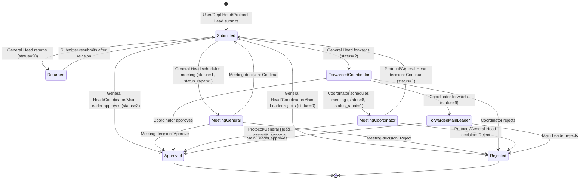
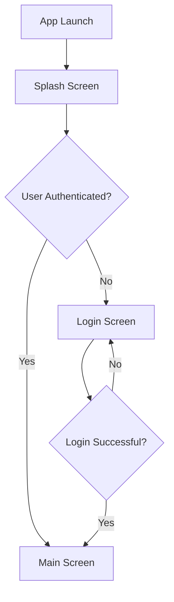
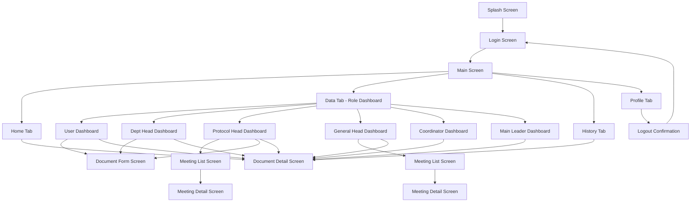
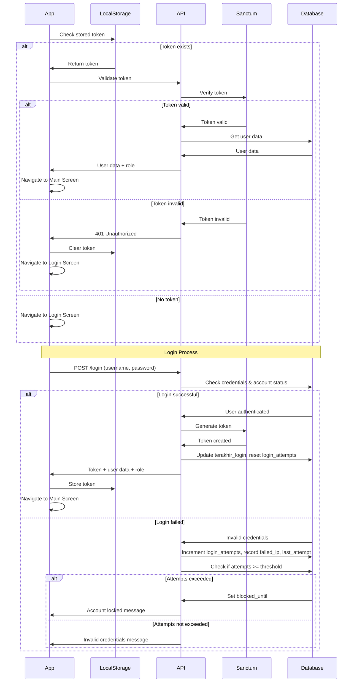
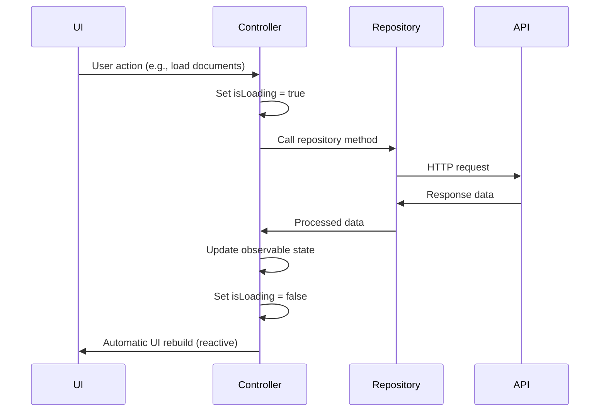

# Role-Based Dashboard Setup Design

## 1. Application Overview

### 1.1 Application Identity
- **Application Name**: SIAP (Sistem Informasi Administrasi Protokoler)
- **Purpose**: Administrative document workflow management system with hierarchical role-based approval process
- **Platform**: Mobile (Flutter)

### 1.2 Technology Stack

| Component | Technology | Purpose |
|-----------|-----------|---------|
| Frontend | Flutter | Cross-platform mobile application |
| State Management | GetX | Reactive state management, dependency injection, and routing |
| Backend | Laravel | RESTful API server |
| Authentication | Laravel Sanctum | Token-based API authentication |

---

## 2. Role Hierarchy & Access Control

### 2.1 Role Definition

The system implements a hierarchical role structure with six distinct levels, where higher-numbered roles have broader access and authority:

| Role Level | Role Name | Authority Level | Role Code |
|------------|-----------|-----------------|-----------|
| 1 | User | Lowest | `user` |
| 2 | Kepala Lembaga/Sekolah/Departemen (Department Head) | Low | `dept_head` |
| 3 | Kepala Protokoler (Protocol Head) | Medium | `protocol_head` |
| 4 | Kepala Bagian Umum (General Affairs Head) | Medium-High | `general_head` |
| 5 | Koordinator (Coordinator) | High | `coordinator` |
| 6 | Pimpinan Utama (Main Leader) | Highest | `main_leader` |

### 2.2 Access Control Matrix

| Capability | User | Dept Head | Protocol Head | General Head | Coordinator | Main Leader |
|------------|------|-----------|---------------|--------------|-------------|-------------|
| Submit documents | ✓ | ✓ | ✓ | ✓ | ✗ | ✗ |
| View own documents | ✓ | ✗ | ✗ | ✗ | ✗ | ✗ |
| View department documents | ✗ | ✓ | ✓ | ✗ | ✗ | ✗ |
| View all submitted documents | ✗ | ✗ | ✗ | ✓ | ✗ | ✗ |
| View forwarded documents (status=2) | ✗ | ✗ | ✗ | ✗ | ✓ | ✗ |
| View escalated documents (status=9) | ✗ | ✗ | ✗ | ✗ | ✗ | ✓ |
| Edit/Delete before approval | ✓ | ✓ | ✓ | ✗ | ✗ | ✗ |
| Approve documents | ✗ | ✗ | ✗ | ✓ | ✓ | ✓ |
| Return documents | ✗ | ✗ | ✗ | ✓ | ✗ | ✗ |
| Forward to coordinator | ✗ | ✗ | ✗ | ✓ | ✗ | ✗ |
| Forward to main leader | ✗ | ✗ | ✗ | ✗ | ✓ | ✗ |
| Manage meetings | ✗ | ✗ | ✓ | ✓ | ✗ | ✗ |

---

## 3. Document Status & Workflow States

### 3.1 Status Code Definition

| Status Code | Status Name | Description | Triggered By |
|-------------|-------------|-------------|--------------|
| 0 | Rejected | Document has been rejected | General Head, Coordinator, Main Leader |
| 1 | Pending/Submitted | Initial submission or in progress | User, Dept Head, Protocol Head, General Head |
| 2 | Forwarded to Coordinator | Document escalated to coordinator level | General Head |
| 3 | Approved | Document has been approved | General Head, Coordinator, Main Leader |
| 8 | Coordinator Meeting Pending | Meeting scheduled at coordinator level | Coordinator |
| 9 | Forwarded to Main Leader | Document escalated to highest authority | Coordinator |
| 20 | Returned | Document sent back to submitter for revision | General Head |

### 3.2 Meeting Status Definition

| Meeting Status Code | Meeting Status Name | Description |
|---------------------|---------------------|-------------|
| 0 | No Meeting | Document not scheduled for meeting |
| 1 | Meeting Scheduled | Document scheduled for meeting discussion |

### 3.3 Workflow State Diagram



---

## 4. Role-Specific Workflows

### 4.1 User Workflow

**Primary Capabilities**:
- Submit new documents with initial status = 1
- Edit or delete own documents while status = 1 and not yet approved by General Head
- View only documents created by themselves (filtered by user_id)

**Dashboard View**:
- Display documents filtered by: `user_id = current_user.id`
- Show document submission form
- Display document list with status indicators

### 4.2 Kepala Lembaga/Sekolah/Departemen (Department Head) Workflow

**Primary Capabilities**:
- Submit new documents with initial status = 1
- Edit or delete own documents while status = 1 and not yet approved by General Head
- View all documents within their department (filtered by departemen_id)

**Dashboard View**:
- Display documents filtered by: `departemen_id = current_user.departemen_id`
- Show document submission form
- Display department-wide document list with status indicators

### 4.3 Kepala Bagian Umum (General Affairs Head) Workflow

**Primary Capabilities**:
- View all documents submitted by User and Department Head (status = 1)
- Execute five types of actions on submitted documents:
  1. **Accept**: Set status = 3 (Approved)
  2. **Return**: Set status = 20 (Returned for revision)
  3. **Reject**: Set status = 0 (Rejected)
  4. **Schedule Meeting**: Set status = 1, status_rapat = 1
  5. **Forward to Coordinator**: Set status = 2

**Meeting Management**:
- Dashboard displays a meeting widget/card showing count of documents with status_rapat = 1
- Clicking the meeting card displays list of meeting documents
- Clicking a document row opens meeting detail view with action dropdown:
  - Accept: status = 3
  - Continue: status = 1
  - Reject: status = 0

**Dashboard View**:
- Display all documents with status = 1 from all users and department heads
- Meeting card widget with counter and navigation to meeting list
- Action buttons for each document

### 4.4 Kepala Protokoler (Protocol Head) Workflow

**Primary Capabilities**:
- Submit new documents with initial status = 1
- Edit or delete own documents while status = 1 and not yet approved by General Head
- View all documents within their department (filtered by departemen_id)
- View and manage meeting documents with (status = 1 OR status = 8) AND status_rapat = 1
- Edit meeting decisions similar to General Head

**Dashboard View**:
- Display documents filtered by: `departemen_id = current_user.departemen_id`
- Display meeting documents with filter: `(status = 1 OR status = 8) AND status_rapat = 1`
- Meeting management interface identical to General Head
- Document submission form

### 4.5 Koordinator (Coordinator) Workflow

**Primary Capabilities**:
- View all documents forwarded by General Head (status = 2)
- Execute four types of actions:
  1. **Accept**: Set status = 3 (Approved)
  2. **Reject**: Set status = 0 (Rejected)
  3. **Schedule Meeting**: Set status = 8, status_rapat = 1
  4. **Forward to Main Leader**: Set status = 9

**Dashboard View**:
- Display documents filtered by: `status = 2`
- Action buttons for document processing
- No document submission capability

### 4.6 Pimpinan Utama (Main Leader) Workflow

**Primary Capabilities**:
- View all documents forwarded by Coordinator (status = 9)
- Execute two types of actions:
  1. **Accept**: Set status = 3 (Approved)
  2. **Reject**: Set status = 0 (Rejected)

**Dashboard View**:
- Display documents filtered by: `status = 9`
- Simplified action interface (Approve/Reject only)
- No document submission capability

---

## 5. Application Navigation & Screen Structure

### 5.1 Application Entry Flow



### 5.2 Main Screen Layout

The main screen serves as the landing page after successful authentication, displaying:

**Header Section**:
- User profile information (name, photo)
- Department information
- Role badge

**Content Section**:
- Information slider carousel for announcements and updates

**Bottom Navigation Sheet** (4 tabs):

| Tab | Icon | Label | Purpose |
|-----|------|-------|---------|
| 1 | Home icon | Home | Main landing view with user info and slider |
| 2 | Dashboard icon | Data | Role-specific dashboard displaying relevant documents |
| 3 | History icon | History | Document creation history (last 10 items) |
| 4 | Profile icon | Profil | User profile and logout functionality |

### 5.3 Screen Hierarchy



---

## 6. Screen Specifications

### 6.1 Splash Screen

**Purpose**: Brand introduction and authentication check during app initialization

**Display Elements**:
- Application logo
- Application name (SIAP)
- Tagline or subtitle
- Loading indicator

**Duration**: 2-3 seconds or until authentication check completes

**Navigation Logic**:
- If user has valid authentication token → Navigate to Main Screen
- If user not authenticated → Navigate to Login Screen

### 6.2 Login Screen

**Purpose**: User authentication

**Form Fields**:
- Username input field (maps to `username` from tbl_user)
- Password input field (maps to `password` from tbl_user)
- "Remember Me" checkbox (optional)
- Login button

**Security Features**:
- Track login attempts (increment `login_attempts`)
- Record failed attempt timestamp (`last_attempt`)
- Record IP address on failure (`failed_ip`)
- Block account temporarily if attempts exceed threshold (`blocked_until`)

**API Interaction**:
- Send credentials to Laravel Sanctum authentication endpoint
- Receive authentication token on success
- Store token locally (maps to `token` from tbl_user)
- Update `terakhir_login` timestamp

**Validation Rules**:
- Both fields required
- Display error message on authentication failure
- Display account locked message if `blocked_until` is in the future

### 6.3 Main Screen - Home Tab

**Purpose**: Welcome view and information distribution

**Display Elements**:

**Profile Card**:
- User photo or avatar
- Full name (from `nama_lengkap`)
- Role/Position (from `jabatan`)
- Department/Institution (from `instansi`)

**Information Slider**:
- Auto-rotating carousel
- Displays announcements, news, or important updates
- Supports images and text overlay
- Manual swipe navigation
- Pagination indicators

### 6.4 Main Screen - Data Tab (Role-Specific Dashboard)

**Purpose**: Display role-appropriate document management interface

The dashboard content dynamically renders based on user role. Each role sees different data and actions:

#### 6.4.1 User Dashboard

**Document List**:
- Filter: `user_id = current_user.id`
- Display fields: Document number, title, submission date, current status
- Status color coding for visual distinction

**Available Actions**:
- "Submit New Document" button
- "Edit" button (visible only when status = 1 and not approved)
- "Delete" button (visible only when status = 1 and not approved)
- "View Detail" button

#### 6.4.2 Department Head Dashboard

**Document List**:
- Filter: `departemen_id = current_user.departemen_id`
- Display fields: Submitter name, document title, submission date, current status
- Status color coding

**Available Actions**:
- "Submit New Document" button
- "Edit" button (for own documents when status = 1 and not approved)
- "Delete" button (for own documents when status = 1 and not approved)
- "View Detail" button

#### 6.4.3 Protocol Head Dashboard

**Section 1: Department Documents**:
- Filter: `departemen_id = current_user.departemen_id`
- Display fields: Submitter name, document title, submission date, status
- Actions: Submit new, Edit own (if status = 1), Delete own (if status = 1), View detail

**Section 2: Meeting Management**:
- Filter: `(status = 1 OR status = 8) AND status_rapat = 1`
- Meeting card widget showing count of pending meeting documents
- Clicking widget navigates to meeting list screen
- Display fields: Document number, title, meeting date, current status

**Meeting List Screen**:
- List all documents with meeting status
- Click row to open meeting detail screen

**Meeting Detail Screen**:
- Display full document information
- Action dropdown with three options:
  - Accept (set status = 3)
  - Continue (set status = 1)
  - Reject (set status = 0)
- Confirmation dialog before action execution

#### 6.4.4 General Affairs Head Dashboard

**Section 1: Pending Documents**:
- Filter: `status = 1` (from all users and department heads)
- Display fields: Submitter name, department, document title, submission date
- Sort: Most recent first

**Action Buttons per Document**:
- Accept button → Set status = 3
- Return button → Set status = 20
- Reject button → Set status = 0
- Schedule Meeting button → Set status = 1, status_rapat = 1
- Forward to Coordinator button → Set status = 2

**Section 2: Meeting Management**:
- Meeting card widget showing count: `COUNT(status_rapat = 1)`
- Clicking widget navigates to meeting list screen
- Meeting List Screen: Same structure as Protocol Head
- Meeting Detail Screen: Same action options (Accept, Continue, Reject)

#### 6.4.5 Coordinator Dashboard

**Document List**:
- Filter: `status = 2` (documents forwarded by General Head)
- Display fields: Submitter name, department, document title, submission date, forwarded date
- Sort: Most recent first

**Action Buttons per Document**:
- Accept button → Set status = 3
- Reject button → Set status = 0
- Schedule Meeting button → Set status = 8, status_rapat = 1
- Forward to Main Leader button → Set status = 9

#### 6.4.6 Main Leader Dashboard

**Document List**:
- Filter: `status = 9` (documents forwarded by Coordinator)
- Display fields: Submitter name, department, document title, submission date, forwarded date
- Sort: Most recent first

**Action Buttons per Document**:
- Accept button → Set status = 3
- Reject button → Set status = 0

**Simplified Interface**:
- Only two actions available (final decision authority)
- Prominent action buttons for quick decision-making

### 6.5 Main Screen - History Tab

**Purpose**: Track document creation history for the current user

**Display Elements**:

**Date Range Filter**:
- Start date picker
- End date picker
- Apply filter button
- Clear filter button

**Document List**:
- Query logic: Retrieve last 10 documents created by current user within selected date range
- Default: Last 10 documents without date filter
- Display fields:
  - Document number
  - Document title
  - Submission date
  - Current status with color indicator
  - Last updated date

**Interaction**:
- Click document row to view detail screen
- Pull-to-refresh to reload history
- Empty state message when no documents found

### 6.6 Main Screen - Profile Tab

**Purpose**: Display user information and account management

**Display Elements**:

**Profile Information Section**:
- User photo/avatar (large display)
- Full name (from `nama_lengkap`)
- Username (from `username`)
- Email (from `email`)
- Phone number (from `telp`)
- Address (from `alamat`)
- Institution (from `instansi`)
- Position/Role (from `jabatan`)
- Experience (from `pengalaman`)
- Registration date (from `tgl_daftar`)
- Last login (from `terakhir_login`)

**Account Management Section**:
- Logout button with icon
- Logout confirmation dialog before executing

**Logout Logic**:
- Show confirmation dialog: "Are you sure you want to logout?"
- On confirm:
  - Clear local authentication token
  - Clear user session data
  - Navigate to Login Screen

### 6.7 Document Detail Screen

**Purpose**: Display comprehensive document information

**Display Elements**:
- Document metadata (number, title, description, dates)
- Submitter information
- Department information
- Current status with visual indicator
- Status history timeline showing all status changes
- Document attachments (if applicable)
- Comments or notes (if applicable)

**Conditional Actions**:
- Actions displayed based on user role and document status
- Back button to return to previous screen

### 6.8 Document Form Screen

**Purpose**: Create or edit document submission

**Form Fields** (to be determined based on document requirements):
- Document title
- Document type/category
- Description
- Department selection (auto-filled for dept head/protocol head)
- Attachment upload
- Additional metadata fields as needed

**Form Actions**:
- Save as draft (if applicable)
- Submit button → Set status = 1
- Cancel button → Return to previous screen

**Validation**:
- Required field validation
- File type and size validation for attachments
- Confirmation before submission

---

## 7. Authentication & User Management

### 7.1 User Data Structure

The system uses `tbl_user` table with the following relevant fields for authentication and authorization:

| Field Name | Purpose | Usage in Application |
|------------|---------|---------------------|
| id_user | Unique user identifier | Primary key, document ownership |
| username | Login credential | Authentication |
| password | Login credential | Authentication (hashed) |
| nama_lengkap | User's full name | Display in profile and UI |
| jabatan | User's position/role | Display role information |
| instansi | User's institution/department | Department filtering |
| email | Contact information | Communication, profile display |
| alamat | User's address | Profile display |
| telp | Phone number | Contact information |
| pengalaman | User experience/background | Profile display |
| level | General user level | Not used in current design |
| level_pimpinan | Leadership level | Role determination |
| level_tu | Administrative level | Role determination |
| level_admin | Admin level | Role determination |
| level_manajemen | Management level | Role determination |
| kode_user | User code | Additional identifier |
| status | Account status | Account active/inactive check |
| tgl_daftar | Registration date | Profile information |
| terakhir_login | Last login timestamp | Session tracking |
| token | Authentication token | Sanctum token storage |
| fcm_token | Firebase Cloud Messaging token | Push notification |
| login_attempts | Failed login counter | Security: brute force prevention |
| last_attempt | Last failed login time | Security: attempt tracking |
| blocked_until | Account lock expiration | Security: temporary account lock |
| failed_ip | IP address of failed attempt | Security: tracking suspicious activity |

### 7.2 Role Determination Logic

The application determines user role based on level fields in tbl_user. The mapping logic:

| Role | Determination Rule | Priority |
|------|-------------------|----------|
| Pimpinan Utama | `level_pimpinan` has highest leadership value | 1 (Highest) |
| Koordinator | `level_manajemen` indicates coordinator level | 2 |
| Kepala Bagian Umum | `level_tu` indicates general affairs head | 3 |
| Kepala Protokoler | `level_pimpinan` indicates protocol head AND department matches | 4 |
| Kepala Lembaga/Sekolah/Departemen | `level_pimpinan` indicates department head level | 5 |
| User | Default role if no special level assigned | 6 (Lowest) |

**Note**: The exact values and mapping logic for level fields will be determined during backend implementation. The frontend will receive role information from the authentication API response.

### 7.3 Authentication Flow



### 7.4 Security Requirements

**Password Security**:
- Passwords stored as hashed values (bcrypt/argon2)
- Minimum password strength requirements (to be defined)

**Token Management**:
- Tokens expire after defined period (configurable in Sanctum)
- Token refresh mechanism for extended sessions
- Secure token storage on device (encrypted shared preferences/keychain)

**Brute Force Prevention**:
- Maximum login attempts: 5 (configurable)
- Account lock duration: 15 minutes (configurable)
- Lock duration increases with repeated violations

**Session Management**:
- Single active session per user (optional requirement)
- Logout invalidates token on server
- Automatic logout on token expiration

---

## 8. State Management Architecture (GetX)

### 8.1 State Management Strategy

The application uses GetX for comprehensive state management, dependency injection, and routing.

### 8.2 Controller Structure

Each major feature has a dedicated controller:

| Controller | Responsibility | Managed State |
|------------|---------------|---------------|
| AuthController | Authentication, login, logout, session management | User data, authentication token, login state |
| DashboardController | Role-specific dashboard data | Document lists, filters, action states |
| DocumentController | Document CRUD operations | Document forms, submission state, validation |
| MeetingController | Meeting management | Meeting lists, meeting decisions |
| HistoryController | History view and filtering | History documents, date filters |
| ProfileController | User profile display | User profile data |
| NavigationController | Bottom navigation state | Current tab index |

### 8.3 Dependency Injection Pattern

**Service Layer**:
- ApiService: HTTP client wrapper for API communication
- AuthService: Authentication operations
- StorageService: Local data persistence
- NotificationService: Push notification handling (FCM)

**Repository Layer**:
- UserRepository: User data operations
- DocumentRepository: Document data operations
- DepartmentRepository: Department data operations

**Bindings**:
- Initial bindings for app-wide dependencies (ApiService, StorageService, AuthService)
- Lazy bindings for screen-specific controllers

### 8.4 Reactive State Pattern

**Observable State**:
- Use `.obs` for reactive variables that trigger UI updates
- Examples: `isLoading.obs`, `documentList.obs`, `selectedStatus.obs`

**State Update Flow**:


### 8.5 Error Handling Strategy

**Error Types**:
- Network errors (no connection, timeout)
- Authentication errors (401, 403)
- Validation errors (400)
- Server errors (500)

**Error Handling Pattern**:
- Controllers catch exceptions from repository/service layer
- Display user-friendly error messages using GetX snackbar
- Log errors for debugging
- Retry mechanism for network failures

---

## 9. API Integration Specification

### 9.1 API Base Configuration

| Configuration | Value |
|---------------|-------|
| Protocol | HTTPS |
| Base URL | To be configured (environment-specific) |
| Authentication | Bearer token (Laravel Sanctum) |
| Request Format | JSON |
| Response Format | JSON |

### 9.2 API Endpoints

#### 9.2.1 Authentication Endpoints

| Endpoint | Method | Purpose | Request Body | Response |
|----------|--------|---------|--------------|----------|
| /api/login | POST | User authentication | `{username, password}` | `{token, user_data, role}` |
| /api/logout | POST | Invalidate token | - | `{message}` |
| /api/user | GET | Get current user data | - | `{user_data, role}` |

#### 9.2.2 Document Management Endpoints

| Endpoint | Method | Purpose | Request Parameters | Response |
|----------|--------|---------|-------------------|----------|
| /api/documents | GET | Get documents list | `role`, optional filters | `{documents[]}` |
| /api/documents | POST | Submit new document | Document data | `{document, message}` |
| /api/documents/{id} | GET | Get document detail | - | `{document}` |
| /api/documents/{id} | PUT | Update document | Document data | `{document, message}` |
| /api/documents/{id} | DELETE | Delete document | - | `{message}` |
| /api/documents/{id}/status | PUT | Update document status | `{status, status_rapat, notes}` | `{document, message}` |

#### 9.2.3 Meeting Management Endpoints

| Endpoint | Method | Purpose | Request Parameters | Response |
|----------|--------|---------|-------------------|----------|
| /api/meetings | GET | Get meeting documents | `role` | `{documents[]}` |
| /api/meetings/{id}/decision | POST | Record meeting decision | `{status, notes}` | `{document, message}` |

#### 9.2.4 History Endpoints

| Endpoint | Method | Purpose | Request Parameters | Response |
|----------|--------|---------|-------------------|----------|
| /api/history | GET | Get user history | `start_date`, `end_date`, `limit=10` | `{documents[]}` |

#### 9.2.5 Profile Endpoints

| Endpoint | Method | Purpose | Request Parameters | Response |
|----------|--------|---------|-------------------|----------|
| /api/profile | GET | Get user profile | - | `{user_data}` |
| /api/profile | PUT | Update user profile | Profile data | `{user_data, message}` |

### 9.3 API Request/Response Standards

**Request Headers**:
```
Authorization: Bearer {token}
Content-Type: application/json
Accept: application/json
```

**Standard Response Structure**:

Success Response:
```
{
  "success": true,
  "data": { ... },
  "message": "Success message"
}
```

Error Response:
```
{
  "success": false,
  "error": {
    "code": "ERROR_CODE",
    "message": "Error description",
    "details": { ... }
  }
}
```

**HTTP Status Codes**:
- 200: Success
- 201: Created
- 400: Bad Request / Validation Error
- 401: Unauthorized
- 403: Forbidden
- 404: Not Found
- 422: Unprocessable Entity
- 500: Internal Server Error

---

## 10. Data Models

### 10.1 User Model

| Field | Type | Description | Source |
|-------|------|-------------|--------|
| id | Integer | User ID | id_user |
| username | String | Username | username |
| namaLengkap | String | Full name | nama_lengkap |
| jabatan | String | Position | jabatan |
| instansi | String | Institution | instansi |
| departemenId | Integer | Department ID | (to be determined) |
| email | String | Email address | email |
| alamat | String | Address | alamat |
| telp | String | Phone number | telp |
| pengalaman | String | Experience | pengalaman |
| role | String | User role | Derived from level fields |
| status | Integer | Account status | status |
| tglDaftar | DateTime | Registration date | tgl_daftar |
| terakhirLogin | DateTime | Last login | terakhir_login |
| token | String | Auth token | token |
| fcmToken | String | FCM token | fcm_token |

### 10.2 Document Model

| Field | Type | Description | Notes |
|-------|------|-------------|-------|
| id | Integer | Document ID | Primary key |
| documentNumber | String | Document number | Unique identifier |
| title | String | Document title | Required |
| description | String | Document description | Optional |
| userId | Integer | Submitter user ID | Foreign key to User |
| departemenId | Integer | Department ID | Foreign key to Department |
| status | Integer | Current status | See status codes |
| statusRapat | Integer | Meeting status | 0 or 1 |
| submittedAt | DateTime | Submission timestamp | Auto-generated |
| updatedAt | DateTime | Last update timestamp | Auto-updated |
| approvedBy | Integer | Approver user ID | Nullable |
| approvedAt | DateTime | Approval timestamp | Nullable |
| notes | String | Additional notes | Optional |

### 10.3 Document Status History Model

| Field | Type | Description | Notes |
|-------|------|-------------|-------|
| id | Integer | History ID | Primary key |
| documentId | Integer | Document ID | Foreign key |
| previousStatus | Integer | Status before change | Nullable for initial |
| newStatus | Integer | Status after change | Required |
| changedBy | Integer | User who made change | Foreign key to User |
| changedAt | DateTime | Change timestamp | Auto-generated |
| notes | String | Change reason/notes | Optional |

### 10.4 Department Model

| Field | Type | Description | Notes |
|-------|------|-------------|-------|
| id | Integer | Department ID | Primary key |
| name | String | Department name | Required |
| code | String | Department code | Unique |
| description | String | Department description | Optional |

---

## 11. UI/UX Design Principles

### 11.1 Visual Design Guidelines

**Color Scheme**:
- Primary color: To represent brand identity
- Secondary color: For accents and highlights
- Status colors:
  - Green: Approved (status = 3)
  - Red: Rejected (status = 0)
  - Yellow/Orange: Pending (status = 1)
  - Blue: Forwarded (status = 2, 9)
  - Purple: Meeting (status_rapat = 1)
  - Gray: Returned (status = 20)

**Typography**:
- Clear hierarchy with distinct heading and body text sizes
- Readable font family (e.g., Roboto, Inter)
- Minimum font size: 14px for body text

**Spacing**:
- Consistent padding and margins using 8px grid system
- Adequate touch target sizes (minimum 44x44 dp)

### 11.2 Navigation Patterns

**Bottom Navigation**:
- Always visible on main screens
- Highlight active tab
- Smooth tab transitions

**Back Navigation**:
- Hardware back button support (Android)
- Software back button on app bar
- Breadcrumb navigation for deep screens

**Gesture Support**:
- Pull-to-refresh for document lists
- Swipe gestures for navigation (optional)

### 11.3 Responsive Design

**Screen Sizes**:
- Support for small (320dp), medium (360dp), and large (400dp+) phone screens
- Tablet support (optional enhancement)

**Orientation**:
- Primary support for portrait orientation
- Landscape support for tablets (optional)

### 11.4 Accessibility

**Requirements**:
- Sufficient color contrast ratios (WCAG AA)
- Text scaling support
- Screen reader compatibility
- Touch target sizes meet accessibility standards

### 11.5 Loading States

**Indicators**:
- Skeleton loaders for list items
- Circular progress indicators for full-screen loading
- Inline loaders for action buttons during processing

**Empty States**:
- Friendly messages when no data available
- Illustrations or icons to enhance empty state
- Action suggestions (e.g., "Submit your first document")

### 11.6 Feedback Mechanisms

**Success Feedback**:
- Green snackbar with success icon
- Brief success message (2-3 seconds)

**Error Feedback**:
- Red snackbar with error icon
- Clear error message explaining what went wrong
- Action to retry (when applicable)

**Confirmation Dialogs**:
- For destructive actions (delete, reject)
- Clear action buttons (Confirm/Cancel)
- Explain consequences of action

---

## 12. Performance Considerations

### 12.1 Data Loading Strategies

**Pagination**:
- Load documents in batches (e.g., 20 items per page)
- Infinite scroll or "Load More" button
- Cache loaded pages for quick navigation

**Lazy Loading**:
- Load images on-demand
- Defer non-critical data loading

**Caching**:
- Cache user profile data locally
- Cache frequently accessed reference data (departments, status codes)
- Cache recent document lists with expiration policy

### 12.2 Network Optimization

**Request Optimization**:
- Batch multiple related requests when possible
- Compress request/response payloads
- Use appropriate HTTP caching headers

**Offline Support** (Optional Enhancement):
- Cache read data for offline viewing
- Queue write operations when offline
- Sync when connection restored

### 12.3 State Management Optimization

**Memory Management**:
- Dispose controllers when screens are destroyed
- Limit size of cached document lists
- Clean up unused observables

**Rendering Optimization**:
- Use Obx widgets only where needed
- Avoid unnecessary rebuilds
- Optimize list rendering with proper keys

---

## 13. Push Notification Strategy

### 13.1 Notification Use Cases

| Event | Recipient | Notification Content |
|-------|-----------|---------------------|
| Document submitted | General Affairs Head | "New document submitted by {user}" |
| Document approved | Original submitter | "Your document has been approved" |
| Document rejected | Original submitter | "Your document has been rejected" |
| Document returned | Original submitter | "Your document has been returned for revision" |
| Document forwarded to Coordinator | Coordinator | "New document forwarded for your review" |
| Document forwarded to Main Leader | Main Leader | "New document requires your decision" |
| Meeting scheduled | Protocol Head, General Head | "Document scheduled for meeting discussion" |
| Meeting decision required | Meeting participants | "Your input needed for meeting document" |

### 13.2 Notification Data Structure

**Notification Payload**:
```
{
  "notification": {
    "title": "Notification title",
    "body": "Notification message"
  },
  "data": {
    "type": "document_update",
    "document_id": "123",
    "status": "3",
    "action": "view_document"
  }
}
```

### 13.3 Notification Handling

**Foreground**:
- Display in-app notification banner
- Update relevant data automatically

**Background**:
- System notification tray
- Tapping notification navigates to relevant screen

**FCM Token Management**:
- Register token on login
- Update `fcm_token` field in user table
- Refresh token on expiration

---

## 14. Testing Strategy

### 14.1 Testing Scope

**Unit Testing**:
- Controller logic
- Data model parsing
- Utility functions
- Validation logic

**Widget Testing**:
- Individual screen widgets
- Form validation
- Button interactions
- State changes

**Integration Testing**:
- Authentication flow
- Document submission flow
- Status update flow
- Navigation flow

**API Testing** (Backend):
- Endpoint functionality
- Authentication
- Authorization
- Data validation

### 14.2 Test Cases Priority

**Critical Path Tests**:
1. User login and authentication
2. Document submission by User
3. Document approval by General Affairs Head
4. Document forwarding workflow
5. Role-based access control

**Secondary Tests**:
1. Document editing and deletion
2. Meeting management
3. History filtering
4. Profile management
5. Push notifications

---

## 15. Deployment & Environment Configuration

### 15.1 Environment Configuration

The application supports multiple environments:

| Environment | Purpose | API Base URL |
|-------------|---------|--------------|
| Development | Local development and testing | To be configured |
| Staging | Pre-production testing | To be configured |
| Production | Live application | To be configured |

### 15.2 Configuration Management

**Environment Variables**:
- API base URL
- API timeout settings
- Pagination limits
- Security settings (token expiration)
- FCM configuration

**Build Variants** (Flutter):
- Development build
- Staging build
- Production build (release)

### 15.3 Deployment Checklist

**Pre-Deployment**:
- All critical tests passing
- API endpoints verified
- Security review completed
- Performance testing completed
- User acceptance testing completed

**Deployment Process**:
- Build release APK/IPA
- Code signing with production certificates
- Upload to app store (Google Play / App Store)
- Monitor crash reports and analytics

---

## 16. Future Enhancements (Out of Scope for Initial Release)

### 16.1 Potential Features

**Document Management**:
- Document versioning
- Document templates
- Bulk document operations
- Advanced search and filtering

**Collaboration**:
- In-app comments on documents
- @mentions for user notifications
- Document collaboration workspace

**Analytics & Reporting**:
- Dashboard analytics for management
- Document processing time reports
- User activity reports
- Status distribution charts

**User Experience**:
- Dark mode support
- Multi-language support
- Customizable dashboard widgets
- Advanced notification preferences

**Technical**:
- Offline mode with sync
- Document OCR and scanning
- Biometric authentication
- Advanced caching strategies

---

## 17. Design Decisions & Rationale

### 17.1 Technology Choices

**Flutter + GetX**:
- Rationale: Cross-platform development reduces development time and maintenance effort. GetX provides lightweight, performant state management with minimal boilerplate.

**Laravel Sanctum**:
- Rationale: Sanctum is designed specifically for SPA and mobile app authentication, providing simple token-based authentication without OAuth complexity.

### 17.2 Architecture Decisions

**Role-Based Dashboard Approach**:
- Rationale: Each role has distinct workflows and data needs. Separate dashboards provide focused, role-appropriate interfaces without cluttering UI with irrelevant features.

**Status Code System**:
- Rationale: Numeric status codes enable efficient database queries and straightforward state transitions. Clear status definitions prevent ambiguity in workflow.

**Meeting Status Separation**:
- Rationale: Separate `status_rapat` field allows documents to maintain their primary status while also tracking meeting scheduling. This enables parallel tracking without status code conflicts.

**Bottom Navigation Structure**:
- Rationale: Four-tab structure provides clear separation of concerns: landing (Home), work (Data), history tracking (History), and account management (Profil). This aligns with user mental models.

### 17.3 Security Decisions

**Token-Based Authentication**:
- Rationale: Stateless authentication scales better and works well for mobile apps. Tokens can be easily invalidated on logout.

**Login Attempt Limiting**:
- Rationale: Prevents brute force attacks on user accounts. Temporary locks provide security without permanently blocking legitimate users.

**Role-Based Data Filtering**:
- Rationale: Server-side filtering ensures users only receive data they're authorized to view, preventing unauthorized access even if client is compromised.

---

## Confidence Assessment

**Confidence Level**: High

**Confidence Basis**:
- Requirements are detailed and specific with clear role definitions and workflows
- Technology stack is proven and well-suited for the use case
- Workflow logic is explicitly defined with concrete status codes and transitions
- Database schema information provided enables accurate data modeling
- No significant technical uncertainties or blockers identified
- Design approach is straightforward and follows established patterns
